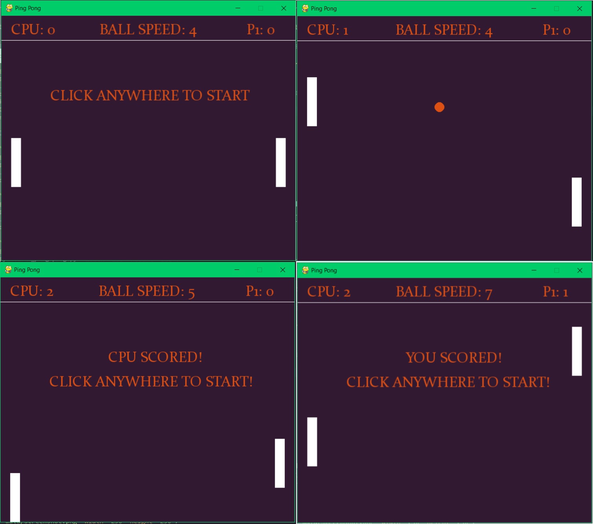
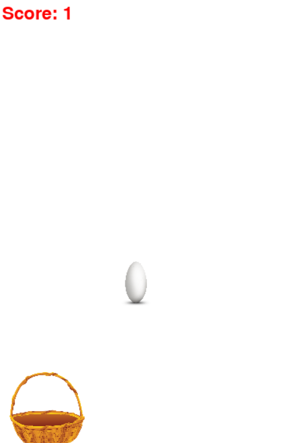

### Task 1 (Ping Pong)

In this task _Ping Pong_ some variables with classes `Ball` and `Paddle` are defined. Check the file named **ai_ping-pong.py**.

_class Ball_

- The `move()` function updates the `winner` variable in the game
- The `draw()` function draws a ball object
- The `reset()` function places the ball object where you define `x` and `y` coordinates

_class Paddle_

- The `move()` function moves the paddle as a player
- The `ai()` function moves the paddle as a robot
- The `draw()` function draws the paddle object

Your mission is to write game logic.

**_Missions:_** TODO

- Define the **font** and **fps**. (font and fps are up to you)
- Draw the scores that located at the top of the screen. (You can create a function that draws text based on screen location))
  
- Define 2 states of the ball during the game.
  - When the ball is in play (**live_ball** = True, should be True when mouse clicked the screen, and when not playing = False)
    - Each time increase the speed by 1
    - Move the ball until a winner is found
    - Scores should be increased depending on the winner
  - When the ball is out of play (**live_ball** = False)
    - Show instructions as shown in the picture above. Locate near the center.
- Define Event handler
  - Quit the game
  - Start the game by clicking the screen or any button.

### Task 2

### Task 3

### Task 4

### Task 5

Your goal is to write a "Eggs Catcher" game in python using pygame library.You have to count the user score and display it on the screen. User can miss maximum 3 eggs, otherwise user loses. Display the final score of the user on the screen. All png files are stored in the data folder.

The game should look like this:



### Task 6

### Task 7

### Task 8

### Task 9

### Task 10

### Task 11

Your task is create "Word Guess" game. You have to create at least two scene (start scene and game scene).  
In game scene user tries guess letter of the hidden word, this word is randomly taken from file (if file does not exist user default word).  
If user guesses letter right, input for this letter is readonly.  
If user guesses word, show winner message.

For this task, you should use several scenes, you can use class below or anythig you want:

```python
class SceneBase:
    def __init__(self):
        pass

    def __init__(self, prev):
        pass

    def ProcessInput(self, events, pressed_keys):
        pass

    def Update(self):
        pass

    def Render(self, screen):
        pass

    def SwitchToScene(self, next_scene):
        pass

    def SwitchBack(self):
        pass

    def Terminate(self):
        pass

```

### Task 12

### Task 13

### Task 14
